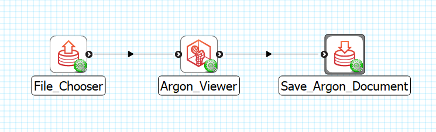

Save Argon Document
===================

Overview
--------

The **Save Argon Document** is a MAP Client plugin for saving an Argon document.

Workflow Connections
--------------------

As shown in :numref:`fig-mcp-save-argon-document-workflow-connections`, the **Save Argon Document** need 1 input.

1. An Argon Document that needs to be saved to local disk. (Port: *https://opencmiss.org/1.0/rdf-schema#ArgonDocument*) 

It does not produce any output to the workflow, the output will be saved to the selected location in the configuration.

.. _fig-mcp-save-argon-document-workflow-connections:

   **Save Argon Document** workflow connections.

Configure
---------

This step comes pre-configured but there are a few parameters to modify the behaviour of the step.
The output directory should be set to a location outside of the current workflow directory.

.. _fig-mcp-save-argon-document-configure-dialog:

.. figure:: _images/step-configuration-dialog.png
   :alt: Step configure dialog

   *Save Argon Document* step configuration dialog.

The *Consolidate Resources* option is for making sure all external resources referenced in the document are copied to the same directory as the Argon document itself.
The purpose of this parameter is to make sharing Argon documents and their resources easier.
