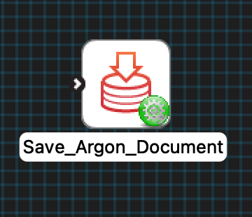
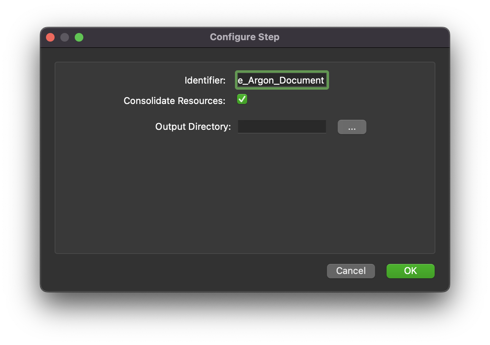

MAP Client Plugin - Save Argon Document
=======================================

The **Save Argon Document** is a MAP Client plugin for exporting an Argon scene.
The plugin uses an Argon document (step uses port definition: https://opencmiss.org/1.0/rdf-schema#ArgonDocument).

.. _fig-mcp-save-argon-document-configured-step:

   A configured *Save Argon Document* step icon.

Configure
---------

This step comes pre-configured but there are a few parameters to modify the behaviour of the step.
The output directory should be set to a location outside of the current workflow directory.

.. _fig-mcp-save-argon-document-configure-dialog:

   Save Argon document step configuration dialog.

The *Consolidate Resources* option is for making sure all external resources referenced in the document are copied to the same directory as the Argon document itself.
The purpose of this parameter is to make sharing Argon documents and their resources easier.